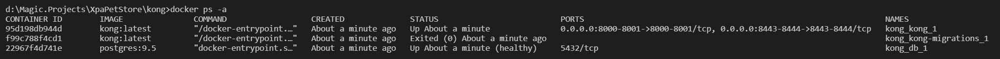

# Starting Kong

You need to have following prerequisites installed and running:
- Docker for Windows
- Nodejs

## Start Kong and Postgres (and create and migrate Postgres DB for usage by Kong)
Open a command line window and set environment variable XPAPETSTORE to your installation directory:
> SET XPAPETSTORE=d:\magic.projects\xpapetstore

Change to kong directory:
> cd %XPAPETSTORE%\kong

Fire up Kong and Postgres DB for Kong:
> docker-compose up -d

Kong and Postgres database should now be up and running, you can verify if thats indeed the case:
> docker ps -a 

> curl http://localhost:8000/

> curl http://localhost:8001/

## Start Konga (Kong dashboard)

Open a command promptry amd change to Konga directory:
> cd %XPAPETSTORE%\kong\konga-master

Install required node modules and start Konga:
> npm i & npm start

Kong and Konga should now run, you can point your browser to following location to log in to Konga:
http://localhost:1337
